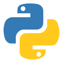

# curso-python-ii
 Repositório do curso Desenvoler aplicações web com Python 2022 do Senac

---

## Conteúdo
- Versionamento
- HTML
- Banco de Dados

***
# TÍTULOS
# Nível 1
## Nível 2
### Nível 3
#### Nível 4
##### Nível 5
###### Nível 6

# LISTAS
## Marcadores
- Item 1
- Item 2
- Item 3

## Numeração
1. Item 1
2. Item 2
3. Item 3

---
# CÓDIGO
## Dentro da linha
Quando precisar um código tipo `print("aaa")` dentro de uma linha.

# Bloco de código
```python
print("Informações")
nome = input("Qual o seu nome?  ")
```
---
# Tabelas
|Linguagem|Plataforma|
|---|---|
|C#|Web, Desktop, Mobile|
|Javascript|Web, Desktop, Mobile|
|PHP|Web, Desktop|
|C| Desktop
---
# FORMATAÇÃO DE TEXTO
- ~~riscado~~
- *itálico*
- **negrito**
- ***negrito e itálico***

---
# IMAGEM


---
# LINK
[Site do Uol](https://uol.com.br)


